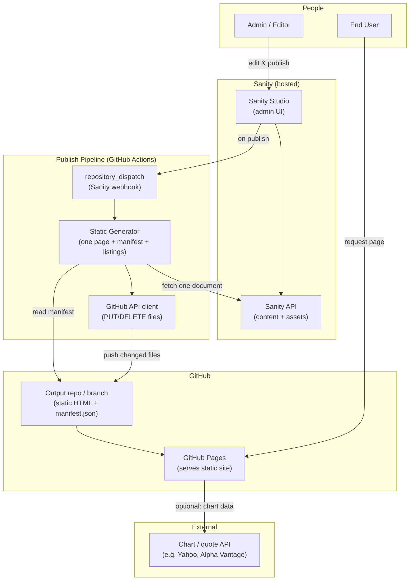
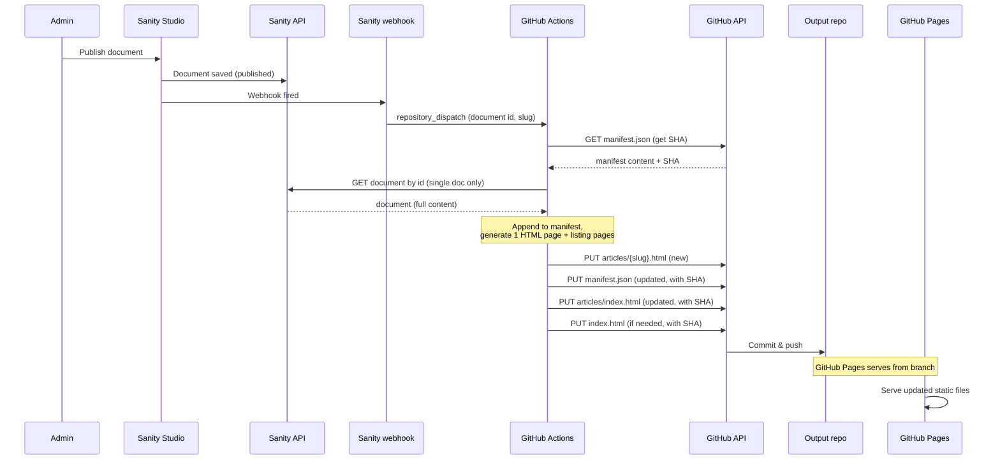
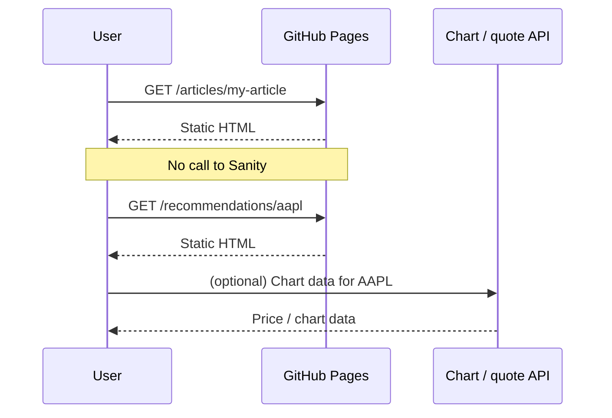
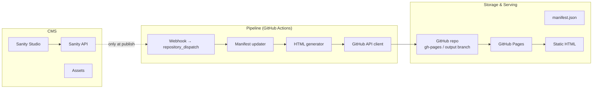
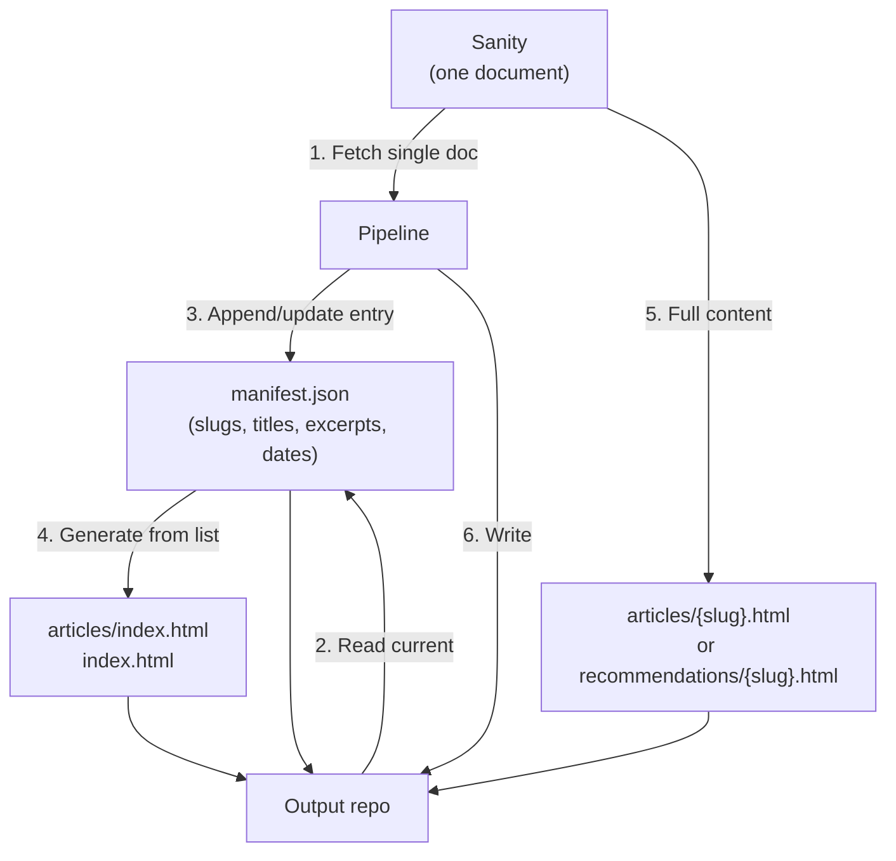

# Long-Term Stocks – Component & Architecture Diagrams

**Site name:** LongTermPicksUSA.

Diagrammatic view of the system components and flows. Diagrams use [Mermaid](https://mermaid.js.org/) and render on GitHub and in many Markdown viewers.

---

## 1. High-Level Components



**Summary:** Admin uses Sanity Studio; on publish a webhook triggers a **GitHub Actions** workflow, which fetches one document from Sanity, updates the manifest, generates static files, and pushes only changed files to the repo; **GitHub Pages** serves the site from that branch; end users hit GitHub Pages only (Sanity not hit on read).

---

## 2. Publish Flow (Sequence)

When admin publishes one article or recommendation:



**Summary:** Single document is read from Sanity; GitHub Actions pushes only new/changed files to the repo; GitHub Pages serves the branch; no full-site regenerate.

---

## 3. End-User Request Flow

When a visitor opens the site (no CMS hit):



**Summary:** Pages are static; GitHub Pages serves them. Sanity is not in the request path. Charts can be loaded client-side from a third-party API.

---

## 4. Component Breakdown



| Component | Responsibility |
|-----------|----------------|
| **Sanity Studio** | Admin UI; create/edit/publish articles & recommendations; upload assets. |
| **Sanity API** | Source of truth for content and asset URLs; called only by pipeline (and Studio). |
| **Webhook → repository_dispatch** | Sanity webhook triggers GitHub Actions workflow (e.g. via GitHub API `repository_dispatch`); passes document id/slug. |
| **Manifest updater** | Reads/updates `manifest.json` (append or update one entry); no full content read from Sanity for listings. |
| **HTML generator** | Builds one article/recommendation page + listing pages from manifest; sanitises HTML. |
| **GitHub API client** | PUT/DELETE only changed paths; uses SHA for updates. |
| **GitHub repo (output)** | Holds static HTML files and manifest; branch served by GitHub Pages. |
| **GitHub Pages** | Serves static site from the configured branch; no separate deploy. |

---

## 5. Data Flow (Manifest & Static Output)



**Summary:** Pipeline fetches one document from Sanity and current manifest from repo; updates manifest; generates one detail page (from Sanity) and listing pages (from manifest); writes only changed files to the repo.

---

## 6. File Layout in Output Repo

```
output branch (or site-output repo)
├── index.html
├── manifest.json
├── articles/
│   ├── index.html
│   ├── article-slug-1.html
│   └── article-slug-2.html
└── recommendations/
    ├── index.html
    ├── aapl.html
    └── msft.html
```

---

*Diagrams align with the feature list (Sanity, GitHub Actions, incremental publish, manifest in repo, GitHub API, GitHub Pages).*
